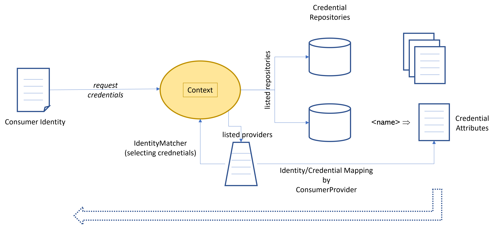

<!-- DO NOT MODIFY                                                 -->
<!-- this file is generated by mdref                               -->
<!-- from ../../docsrc/examples/working-with-credentials/README.md -->

# Working with Credentials


This tour illustrates the basic configuration management. The library provides
an extensible framework to bring together configuration settings
and configuration target.

It covers the following basic scenarios:

- [`basic`](#basic-credential-management) Basic credential management.
- [`repository`](#providing-credentials-via-credential-repositories) Providing credentials via credential repositories.
- [`config`](#using-the-config-management-for-credentials) Using the config management for credentials


## Running the example

You can call the main program with the name of the scenario as argument under `examples/working-with-credentials`.

## General Architecture

The credential management can be found in sub package `credentials`.
It acts as an intermediary between credential sources and consumers.
A credential source is represented as credential `Repository`. It hosts a set of
named credentials. Every entry consists of a set of credential attributes
, simple name/string value pairs.

Active credential repositories are held in the credential context (`credentials.Context`). It is also used to register repository types for various kinds of source repositories. This set can be extended just by registering new types for the default registry are particular contexts. This library come with some standard implementations:
- docker config json
- npm config file
- HasiCorp Vault support
- a memory-based repository type
- direct credentials

Repositories are described by a YAML-based specification, which is mapped
by a context to a repository implementation providing access to the credential entries.

On the other side, there is a credential consumer. A credential consumer can request credentials for a particular purpose, or consumption scenario.
Such a scenario is identified by a so-called *Consumer Type*. It is a string unique identifying the scenario, for example an OCI registry access, a NPM registry access, and so on. Every scenario defines a set of attributes required to describe the concrete scenario, typically a hostname, port, and similar
information required to describe the particular use case the credentials are
supposed to be used for. The consumer type and attributes together are represented as `ConsumerIdentity`.

Now, there is functional gap between the consumer identity and credential repositories offering just named credentials. This gap is bridged by `ConsumerProvider`s. A consumer provider is able to map a consumer identity 
to a credential entry. The context itself manages a simple such provider, which can explicitly be configured by directly adding a mapping for a consumer 
identity to a credential entry in any available credential repository.
This way any available credential can be connected to any number of consumer identities.

But a credential repository implementation can decide to provide an own
`ConsumerProvider`. For example, technology specific configuration files, like
the docker config json, provide credentials exclusively for one particular
scenario. Therefore, it can implicitly map its entries to appropriate
consumer identities.

Another possibility is to establish rules for additional meta data stored along with the credential entry in the back end repository. For example, the vault implementation uses the meta data attribute to retrieve information about the 
intended usage scenario for the entry. This way, it can offer such a consumer provider configured directly at the credential source, the vault.

However this mapping is done, we now have identities for the source side and the
requesting side.
The requesting side should be as accurate as possible in describing the intended
usage scenario. This might involve not only a hostname, but also a port, or a sub
patch (for example for accessing GitHub repositories) ore even more detailed
information. This is useful to be able to distinguish potential different use
cases. But, when specifying the credential, it might be useful to relax this specification, because sub scenarios use the same credentials, or are of no interest. For example, only specifying the hostname, or, more elaborated, only a sub path prefix.



To bridge this additional gap, every scenario has an assigned `IdentityMatcher`,
which is able to determine the best matching enrry when comparing the requested consumer identity with the available identities with assigned credentials.
(By default a host path matcher is used, caring about, hostname, port and path prefix).

The credential management works together with the config management.
A dedicated config object type is used to configure known repositories 
or direct credential mappings.

You will find more details in the following Walkthrough

## Consumer Identities

Consumer identities are a central concept of this crendential management.
For every type of access requiring credentials there must be defined a unique
consumer type. It describes the authentication scenario and defines
the specification attributes and the credential attributes for the scenario.

The specification attributes are the attributes used to concretely describe the
access scenario, for example the host name of a server used for the access, the used
port and URL path or similar attributes.

The credential attributes describe are the attributes required or supported by the
technical access library used to establish an authenticated access.
In a simple case, this is a users and password.

Common attributes are standardized and constants are available (ID_* and ATTR_*).
If possible those attribute names should be reused for the concrete scenario.

For every scenario there should be an `identity` package providing consumer identity
support for the credential management. For the scenarios supported out-of-the-box by this
library, there are sub packages under  `credentials/identity`.

For example, the `oci` package:

```go
package oci

import (
	"github.com/mandelsoft/ctxmgmt/credentials/cpi"
	"github.com/mandelsoft/ctxmgmt/credentials/identity/hostpath"
	"github.com/mandelsoft/ctxmgmt/utils/listformat"
)

// CONSUMER_TYPE is the OCI registry type.
const CONSUMER_TYPE = "OCIRegistry"

// used identity properties.
const (
	ID_TYPE       = hostpath.ID_TYPE
	ID_HOSTNAME   = hostpath.ID_HOSTNAME
	ID_PORT       = hostpath.ID_PORT
	ID_PATHPREFIX = hostpath.ID_PATHPREFIX
	ID_SCHEME     = hostpath.ID_SCHEME
)

// used credential properties.
const (
	ATTR_USERNAME              = cpi.ATTR_USERNAME
	ATTR_PASSWORD              = cpi.ATTR_PASSWORD
	ATTR_IDENTITY_TOKEN        = cpi.ATTR_IDENTITY_TOKEN
	ATTR_CERTIFICATE_AUTHORITY = cpi.ATTR_CERTIFICATE_AUTHORITY
)

func init() {
	attrs := listformat.FormatListElements("", listformat.StringElementDescriptionList{
		ATTR_USERNAME, "the basic auth username",
		ATTR_PASSWORD, "the basic auth password",
		ATTR_IDENTITY_TOKEN, "the bearer token used for non-basic auth authorization",
		ATTR_CERTIFICATE_AUTHORITY, "the certificate authority certificate used to verify certificates",
	})

	cpi.RegisterStandardIdentity(CONSUMER_TYPE, IdentityMatcher, `OCI registry credential matcher

It matches the <code>`+CONSUMER_TYPE+`</code> consumer type and additionally acts like 
the <code>`+hostpath.IDENTITY_TYPE+`</code> type.`,
		attrs)
}

var identityMatcher = hostpath.IdentityMatcher(CONSUMER_TYPE)

func IdentityMatcher(pattern, cur, id cpi.ConsumerIdentity) bool {
	return identityMatcher(pattern, cur, id)
}
```

It defines the id and credential attributes (potentially reusing globally valid constants)
and an identity matcher, which is used to match identities for this consumer type.
It is registered by an `init` function.

Additionally, there are some standard functions for creating a consumer id for
this type. It cares about mapping a typical access configuration to the appropriate
consumer identity:

```go
package oci

import (
	"path"

	"github.com/mandelsoft/ctxmgmt/credentials/cpi"
)

func SimpleCredentials(user, passwd string) cpi.Credentials {
	return cpi.SimpleCredentials(user, passwd)
}

func GetCredentials(ctx cpi.ContextProvider, locator, repo string) (cpi.Credentials, error) {
	return cpi.CredentialsForConsumer(ctx.CredentialsContext(), GetConsumerId(locator, repo), identityMatcher)
}

func GetConsumerId(locator, repo string) cpi.ConsumerIdentity {
	host, port, base := SplitLocator(locator)
	id := cpi.NewConsumerIdentity(CONSUMER_TYPE, ID_HOSTNAME, host)
	if port != "" {
		id[ID_PORT] = port
	}
	if repo == "" {
		id[ID_PATHPREFIX] = base
	} else {
		id[ID_PATHPREFIX] = path.Join(base, repo)
	}
	return id
}
```

Two standard functions should be
- `GetConsumerId` used to compose a consumer identity
- `GetCredentials` used to determine credentials from a credential context provider.

<!------------------------------------------------------------>

## Walkthrough

### Basic Credential Management

The complete example code can be found in [examples/working-with-credentials/01-basic-credential-management.go](01-basic-credential-management.go).

Credentials are handled by the credential context. First we create
a context for our demo. Here, we just use the default context.
It is already configured with all known credential repository types.

```go
	ctx := credentials.DefaultContext()
```

The most simple use case is to directly define credentials
for a dedicated usage scenario at the credential context.
A consumption scenario is defined by a ConsumerIdentity.
It always describes the scenario type (demo) and additional
attributes which concretize the scenario.
Credentials consist of a set of credential attributes,
like username or password.

There are standard keys defined for such common attributes.

```go
	defid := credentials.NewConsumerIdentity("demo", hostpath.ID_HOSTNAME, "localhost", hostpath.ID_PATHPREFIX, "repositories")

	creds := credentials.CredentialsFromList(credentials.ATTR_USERNAME, "testuser", credentials.ATTR_PASSWORD, "testpass")
	// creds := crednetials.SimpleCredentials("testuser", "testpass")

	ctx.SetCredentialsForConsumer(defid, creds)
```

We use the following consumer identity for our credential definition:

```yaml
setting credentials for {"hostname":"localhost","pathprefix":"repositories","type":"demo"}
```

It defines a pathprefix and the credentials should be valid for all sub paths.

Now, we can try to request credentials.
First, we describe our intended scenario.
We want to access some element of this *demo* scenario under the path
`repositories/first`.

```go
	cid := credentials.NewConsumerIdentity("demo", hostpath.ID_HOSTNAME, "localhost", hostpath.ID_PATHPREFIX, "repositories/first")

	helper.Output("request id", func() {
		fmt.Printf("requesting credentials for %s\n", cid)
	})
```

Therefore, we use the following consumer identity:

```yaml
requesting credentials for {"hostname":"localhost","pathprefix":"repositories/first","type":"demo"}
```


With this consumer id we can query credentials from the context.
Because we use an ad-hoc scenario type (`demo`), we explicitly specify an 
appropriate identity matcher. We use the default `hostpath` matcher able to
match path prefixes.

```go
	credsrc, err := ctx.GetCredentialsForConsumer(cid, hostpath.IdentityMatcher("demo"))
	if err != nil {
		return errors.Wrapf(err, "error matching consumer id %s", cid)
	}
	if credsrc == nil {
		return fmt.Errorf("no crendials found for %s", cid)
	}
```

The provided result represents a dynamic credential representation. It might
change if the underlying credential source changes the credentials.
It is used to retrieve concrete credential attributes.

```go
	creds, err := credsrc.Credentials(ctx)
	if err != nil {
		return errors.Wrapf(err, "error getting credentials for %s", cid)
	}
```

And we finally get the expected credentials:

```
found crednetials for {"password":"testpass","username":"testuser"}
```

If we change the pathprefix for the request to `otherpath`,
no credentials are found anymore.

```go
	cid[hostpath.ID_PATHPREFIX] = "otherpath"

	creds, err = credentials.CredentialsForConsumer(ctx, cid, hostpath.IdentityMatcher("demo"))
	if creds != nil {
		return fmt.Errorf("Ooops, found credentials for %s", cid)
	}
```

Instead of the split query of credentials, there is a helper
function `credentials.CredentialsForConsumer`, which directly provides 
the concrete credential attributes in one step. Here, an error is provided if something went wrong. If no credentials
are found, no errors is returned, but just a `nil` pointer for the credentials.

<!------------------------------------------------------------>

### Providing credentials via credential repositories

The complete example code can be found in [examples/working-with-credentials/02-credential-repositories.go](02-credential-repositories.go).

The credential management supports so-called
credential repositories (type `Repository`). Such a repository
is able to provide any number of named
credential sets. This way any special
credential store can be connected to the
credential management just by providing
an own implementation for the repository interface.

One such case is the docker config json, a config
file used by <code>docker login</code> to store
credentials for dedicated OCI registries.

We start again by providing access to the
credential context.

```go
	ctx := credentials.DefaultContext()
```

In package `credentials/extensions/repositories` you can find
packages for predefined implementations for some standard credential repositories,
for example `dockerconfig`.

We use a sample docker config:

```json
{
	"auths": {
      "ghcr.io": {
        "auth": "dGVzdHVzZXI6dGVzdHBhc3MK"
      }
    }
}
```

To create such a repository, first a specification object
has to be created.

```go
	dspec := dockerconfig.NewRepositorySpec(".docker/config.json")
```

There are general credential stores, like a HashiCorp Vault
or type-specific ones, like the docker config json
used to configure credentials for the docker client.
(working with OCI registries).
Those specialized repository implementations are not only able to
provide credential sets, they also know about the usage context
of the provided credentials.
Therefore, such repository implementations are also able to provide
credential mappings for consumer ids. This is supported by the credential
repository API provided by this library.

The docker config is such a case, so we can instruct the
repository to automatically propagate appropriate the consumer id
mappings. This feature is typically enabled by a dedicated specification
option.

```go
	dspec = dspec.WithConsumerPropagation(true)
```

Implementations for more generic credential repositories can also use this
feature, if the repository allows adding arbitrary metadata. This is for
example used by the `vault` implementation. It uses dedicated attributes
to allow the user to configure intended consumer id properties.

Now, we can just add the repository for this specification to
the credential context by getting the repository object for our
specification.

```go
	_, err := ctx.RepositoryForSpec(dspec)
	if err != nil {
		return errors.Wrapf(err, "invalid credential repository")
	}
```

We are not interested in the repository object, so we just ignore
the result.

The sample file contains an entry for `ghcr.io`, so we can use it without calling `docker login`.

We first create the consumer id for the repository.

```go
	id := oci.GetConsumerId("ghcr.io", "acme.org/service")
```

and then get the credentials from the credentials context like in the previous example.

```go
	creds, err := credentials.CredentialsForConsumer(ctx, id)
	if err != nil {
		return errors.Wrapf(err, "no credentials")
	}
	// an error is only provided if something went wrong while determining
	// the credentials. Delivering NO credentials is a valid result.
	if creds == nil {
		return fmt.Errorf("no credentials found")
	}
```

It returns the configured credentials:

```
found crednetials for {"password":"testpass","username":"testuser"}
```

<!------------------------------------------------------------>

### Using the config management for credentials


The complete example code can be found in [examples/working-with-credentials/03-using-credential-config.go](03-using-credential-config.go).

The credential management uses the config management to configure
itself.
Therefore, a credential context incorporates a config context.
It acts as `ConfigProvider` and can return its configuration
context:

```go
	_ = ctx.ConfigContext()
```

We want to the config management now to configure the 
credential management. It is possible to configure repositories,
direct credential assignments, consumer identity mappings.
How to configure direct credentials has already been shown in the
[config tour](../working-with-config/README.md#providing-new-config-object-types).

We will create a central configuration file by using the
API. First, we create the `dockerconfig` credential repository
specification:

```go
	repospec := dockerconfig.NewRepositorySpec("~/.docker/config.json", true)
```

All repository types are described by a repository specification.
This specification is serializable and can be used by the 
credentials context to create an appropriate repository object.

Because of this feature such a specification is embeddable
into a configuration object. The credential management provides
an own configuration object type, which can be configured
with arbitrary repository specifications.

```go
	ccfg := credcfg.New()
	err := ccfg.AddRepository(repospec)
	if err != nil {
		return errors.Wrapf(err, "invalid credential config")
	}
```

By adding the default location for the standard Docker config
file, all credentials provided by the `docker login` command 
are available in our context management environment, also.
For testing, we just use our local version.

This config object can then be added to a config management configuration

```go
	cfg := configcfg.New()
	err = cfg.AddConfig(ccfg)

	spec, err := yaml.Marshal(cfg)
	if err != nil {
		return errors.Wrapf(err, "marshal central config")
	}
```

A typical minimal <code>.acmeconfig</code> file can be composed as follows.
We add this config object to an empty generic configuration object
and print the serialized form. The result can be used as
default initial configuration file.

```yaml
configurations:
- repositories:
  - repository:
      dockerConfigFile: ~/.docker/config.json
      propagateConsumerIdentity: true
      type: DockerConfig
  type: credentials.config.mandelsoft.de
type: generic.config.mandelsoft.de
```
We can use this config file now to configure
the configuration context of our credential context.
The credential context acts as config context provider
and can directly be passed to the configuration function.

```go
	err = cfgutils.ConfigureByData(ctx, spec, "central config")
	if err != nil {
		return errors.Wrapf(err, "invalid central config")
	}
```

We again create the consumer id for the repository

```go
	cid := oci.GetConsumerId("ghcr.io", "acme.org/service")
```

and then get the credentials from the credentials context like in the previous example.

```go
	creds, err := credentials.CredentialsForConsumer(ctx, cid)
	if err != nil {
		return errors.Wrapf(err, "no credentials")
	}
	// an error is only provided if something went wrong while determining
	// the credentials. Delivering NO credentials is a valid result.
	if creds == nil {
		return fmt.Errorf("no credentials found")
	}
```

It returns the configured credentials:

```
credentials: {"password":"testpass","serverAddress":"ghcr.io","username":"testuser"}
```


<!------------------------------------------------------------>